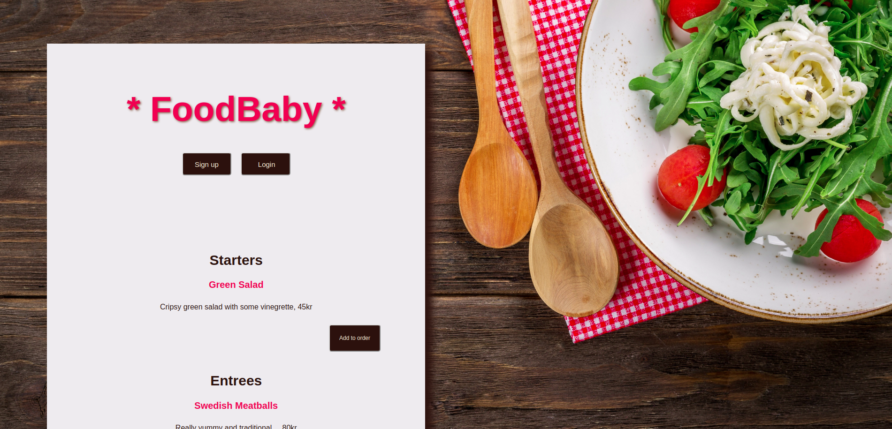

# FoodBaby (API)

### Authors
[Emma-Maria Thalen](https://github.com/emtalen)  
[Kayla Woodbury](https://github.com/kaylawoodbury)  
[Karolina Frostare](https://github.com/kfrostare)  
[Blake Erickson](https://github.com/blake-futchi)  
## Built with
**Front End:** React v.16.12.0 | CSS  
**Back End:** Ruby 2.5.1 | Rails 6.0.2 
**Testing framework:** Cypress  
**Deployed at:** [Netlify](https://slowfood-team1.netlify.com/) and [Heroku](https://yummy-food-api.herokuapp.com).
## The code   
This project is the client facing side of our Slowfood application. The master repository for the Slowfood API, built in Rails, can be found [Here](https://github.com/CraftAcademy/slowfood_api_team_1).
## Getting started
### Dependencies  
* Yarn
* React
* Cypress
* Axios
### Setup   
To test this application, fork the repo to your own GitHub account and clone it to your local workspace. </br>
*Note:* Be sure to set up backend api first (noted above), in order to fully interact with the application. 
Install all of the dependencies:    
```
$ yarn install
```  
Start cypress and run the feature tests:  
```
$ yarn run cy:open
```
Start the backend api (if already configured) in a separate terminal (only run this command for the Rails application):
```
$ rails s
```
Start the React application and run it on your local host:
```
$ yarn start
```
## Updates/Improvements   
- The menu should be displayed even when you're not authenticated, but the order functionality should not be visible if you're not authenticated (use non-component states)
- Adding a restaurant owner interface
- For user to be able to delete their order
- For user to be able to remove specific items from existing order
- Update functionality for adding multiple of the same item without having to click the button several time
- Having a 'special-requests'- section for a dish, for example accommodating allergies
- Refactoring and extracting certain functionalities to make the code more readable
- Add more styling
## License  
[MIT-license](https://en.wikipedia.org/wiki/MIT_License)
### Acknowledgement  
- Material provided by [Craft Academy](https://craftacademy.se)
- [Thomas Ochman](https://github.com/tochman/slowfood-client-team-1/tree/add_to_order_demo) for continued guidance throughout the order functionalities
- [Oliver Ochman](https://github.com/oliverochman/slowfood-client-team-1) for helping us understanding refactoring and how to utilize one module for multiple purposes